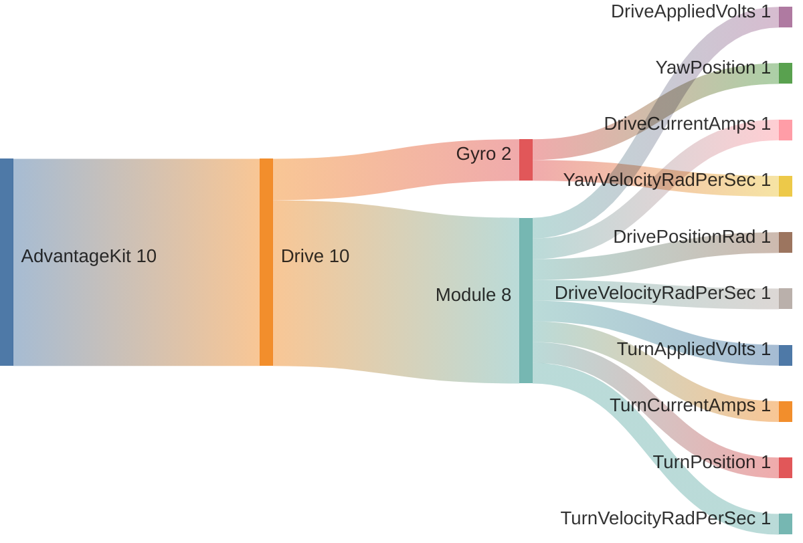

```mermaid
sankey-beta

AdvantageKit,"Drive",10

Drive,"Gyro",2
Drive,"Module",8

Gyro,"YawPosition",1
Gyro,"YawVelocityRadPerSec",1

Module,"DriveAppliedVolts",1
Module,"DriveCurrentAmps",1
Module,"DrivePositionRad",1
Module,"DriveVelocityRadPerSec",1
Module,"TurnAppliedVolts",1
Module,"TurnCurrentAmps",1
Module,"TurnPosition",1
Module,"TurnVelocityRadPerSec",1

```