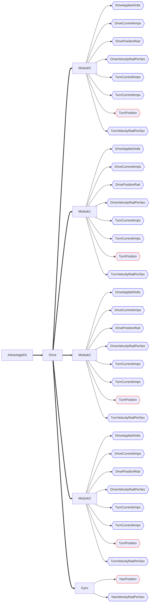

```mermaid
flowchart LR
    AdvantageKit ==> Drive
    Drive ==> Module0
    Drive ==> Module1
    Drive ==> Module2
    Drive ==> Module3
    Drive ==> Gyro

    Module0 --> DriveAppliedVolts0{{DriveAppliedVolts}}:::double
    Module0 --> DriveCurrentAmps0{{DriveCurrentAmps}}:::double
    Module0 --> DrivePositionRad0{{DrivePositionRad}}:::double
    Module0 --> DriveVelcoityRadPerSec0{{DriveVelcoityRadPerSec}}:::double
    Module0 --> TurnAppliedVolts0{{TurnCurrentAmps}}:::double
    Module0 --> TurnCurrentAmps0{{TurnCurrentAmps}}:::double
    Module0 --> TurnPosition0{{TurnPosition}}:::Rotation2d
    Module0 --> TurnVelocityRadPerSec0{{TurnVelocityRadPerSec}}:::double

    Module1 --> DriveAppliedVolts1{{DriveAppliedVolts}}:::double
    Module1 --> DriveCurrentAmps1{{DriveCurrentAmps}}:::double
    Module1 --> DrivePositionRad1{{DrivePositionRad}}:::double
    Module1 --> DriveVelcoityRadPerSec1{{DriveVelcoityRadPerSec}}:::double
    Module1 --> TurnAppliedVolts1{{TurnCurrentAmps}}:::double
    Module1 --> TurnCurrentAmps1{{TurnCurrentAmps}}:::double
    Module1 --> TurnPosition1{{TurnPosition}}:::Rotation2d
    Module1 --> TurnVelocityRadPerSec1{{TurnVelocityRadPerSec}}:::double

    Module2 --> DriveAppliedVolts2{{DriveAppliedVolts}}:::double
    Module2 --> DriveCurrentAmps2{{DriveCurrentAmps}}:::double
    Module2 --> DrivePositionRad2{{DrivePositionRad}}:::double
    Module2 --> DriveVelcoityRadPerSec2{{DriveVelcoityRadPerSec}}:::double
    Module2 --> TurnAppliedVolts2{{TurnCurrentAmps}}:::double
    Module2 --> TurnCurrentAmps2{{TurnCurrentAmps}}:::double
    Module2 --> TurnPosition2{{TurnPosition}}:::Rotation2d
    Module2 --> TurnVelocityRadPerSec2{{TurnVelocityRadPerSec}}:::double

    Module3 --> DriveAppliedVolts3{{DriveAppliedVolts}}:::double
    Module3 --> DriveCurrentAmps3{{DriveCurrentAmps}}:::double
    Module3 --> DrivePositionRad3{{DrivePositionRad}}:::double
    Module3 --> DriveVelcoityRadPerSec3{{DriveVelcoityRadPerSec}}:::double
    Module3 --> TurnAppliedVolts3{{TurnCurrentAmps}}:::double
    Module3 --> TurnCurrentAmps3{{TurnCurrentAmps}}:::double
    Module3 --> TurnPosition3{{TurnPosition}}:::Rotation2d
    Module3 --> TurnVelocityRadPerSec3{{TurnVelocityRadPerSec}}:::double

    Gyro --> YawPosition{{YawPosition}}:::Rotation2d
    Gyro --> YawVelocityRadPerSec{{YawVelocityRadPerSec}}:::double

    classDef Rotation2d stroke:#f00
    classDef double stroke:#00f
```